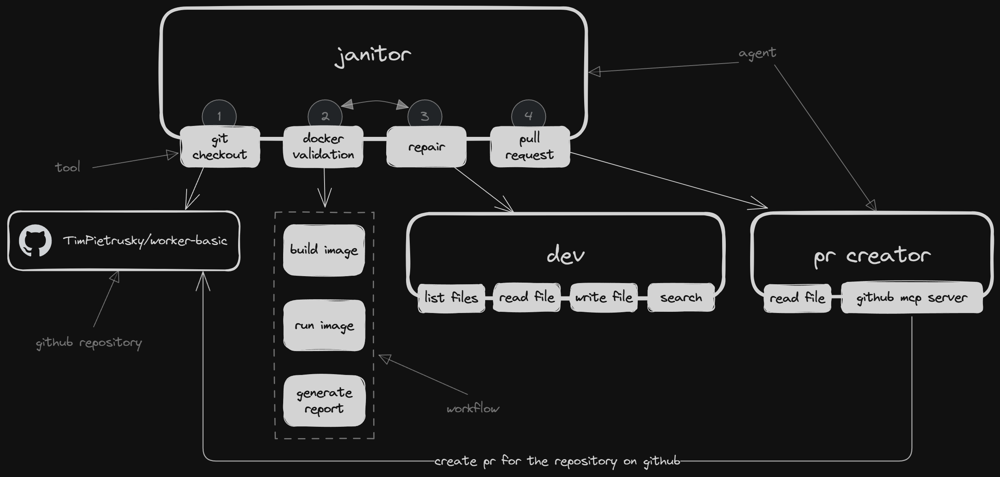

# janitor

> automatically maintain docker repositories with agents



Janitor uses a multi-agent architecture (based on [mastra](https://mastra.ai)) to validate and
repair Docker repositories:

1. **Janitor** (agent) - Coordinates the whole process (validation, repair, feature addition)
2. **Dev** (agent) - Diagnoses and repairs issues, implements new features
3. **PR Creator** (agent) - Creates pull requests with fixes or new features on GitHub

## Getting Started

This guide will help you set up and run Janitor locally for maintaining, enhancing, and validating
Docker repositories.

### Prerequisites

- Node.js (v22 or later)
- npm
- Docker Desktop installed and running
- API keys:
    - [Anthropic API key](https://console.anthropic.com/settings/keys) - Create an account and get
      your API key from the console
    - [GitHub Personal Access Token](https://github.com/settings/tokens) - Create a token with
      `repo` scope
    - [RunPod API key](https://www.runpod.io/console/user/settings) - Sign up for RunPod and create
      an API key in your account settings
    - [RunPod Endpoint ID](https://www.runpod.io/console/serverless) - Create a serverless endpoint
      using vLLM with
      [ToolACE-2-Llama-3.1-8B](https://huggingface.co/Team-ACE/ToolACE-2-Llama-3.1-8B) (or any other
      compatible llm with function calling capabilities) and use its ID

### Installation

1. Clone the repository:

    ```bash
    git clone https://github.com/runpod/janitor.git
    cd janitor
    ```

2. Install dependencies:

    ```bash
    npm install
    ```

3. Set up environment variables:

    ```bash
    cp .env.example .env
    ```

4. Edit the `.env` file and add your API keys + RunPod endpoint configuration

### Development

To start the development server:

```bash
npm run dev
```

This will launch the Mastra development server which allows you to interact with the agents via a
web interface.

### Testing Janitor

**To validate a Docker repository:**

```bash
npm run test:janitor
```

This will:

1. Clone the example repository
   ([TimPietrusky/worker-basic](https://github.com/TimPietrusky/worker-basic))
2. Validate the Dockerfile
3. Attempt repairs if needed
4. Create a PR with fixes (if GitHub token is configured)

**To test adding a feature**

```bash
npm run test:janitor:add-feature
```

This will:

1. Clone the example repository
2. Add the specified feature (e.g., `.runpod` folder, `hub.json`, `tests.json`, README badge)
3. Create a PR with the new feature (if GitHub token is configured)
